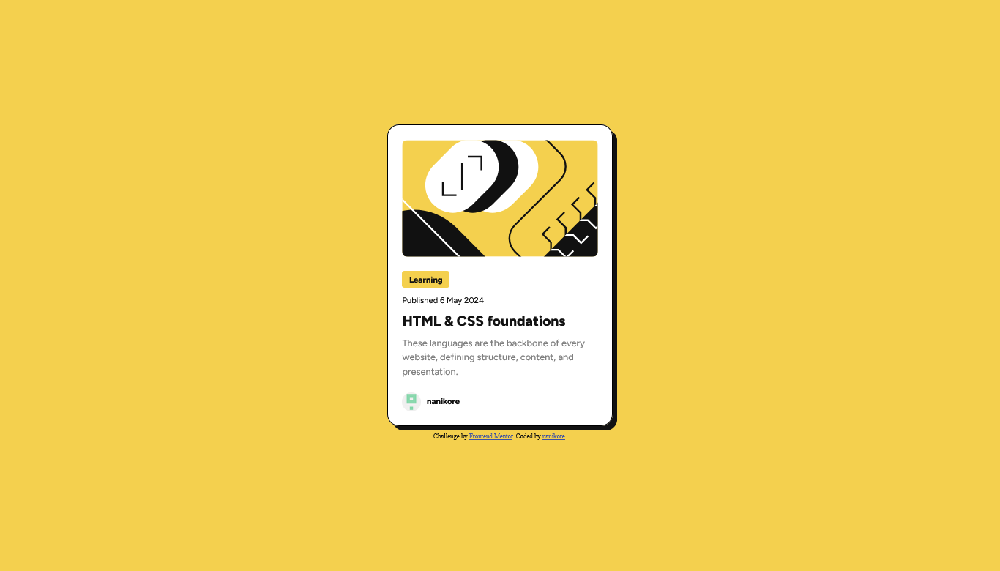

# Frontend Mentor - Blog preview card solution

This is a solution to the [Blog preview card challenge on Frontend Mentor](https://www.frontendmentor.io/challenges/blog-preview-card-ckPaj01IcS). Frontend Mentor challenges help you improve your coding skills by building realistic projects. 

## Table of contents

- [Overview](#overview)
  - [The challenge](#the-challenge)
  - [Screenshot](#screenshot)
  - [Links](#links)
- [My process](#my-process)
  - [Built with](#built-with)
  - [What I learned](#what-i-learned)
  - [Continued development](#continued-development)
  - [Useful resources](#useful-resources)
- [Author](#author)

## Overview

### The challenge

Users should be able to:

- See hover and focus states for all interactive elements on the page

### Screenshot



### Links

- Solution URL: [Solution URL](https://github.com/nanikore0/blog-preview-card-challenge)
- Live Site URL: [Live Site URL](https://nanikore0.github.io/blog-preview-card-challenge/)

## My process

### Built with

- HTML5
- CSS3
- Flexbox
- Mobile-first workflow

### What I learned

With this project I was able to learn about using custom fonts using CSS as well as using media query. I also experimented using CSS Flexbox.

During this project I had trouble when spacing elements evenly inside the content div when using p and h1 elements. After experimenting with my code for a while, what worked for me was using the following CSS code:

```css
.content {
  display: flex;
  flex-direction: column;
  justify-content: space-between;
}

.category, .publishdate, .title, .description {
  margin: 0;
  display: inline-flex;
}
```

This is also my first time using Figma when designing the page and I tried my best to get as close to the design as possible.

### Continued development

With future projects I aim to improve my understanding about using CSS Flexbox as well as Grid.

### Useful resources

- [CSS :hover Selector by w3schools](https://www.w3schools.com/CSSref/sel_hover.php) - This helped me use the :hover selector when interacting with the card title.
- [How to style the parent element when hovering a child element? on stackoverflow](https://stackoverflow.com/Questions/8114657/how-to-style-the-parent-element-when-hovering-a-child-element) - This helped me change the box-shadow of the card element when hovering the card title.
- [CSS Flexbox formatting with p element on stackoverflow](https://stackoverflow.com/questions/60355877/css-flexbox-formatting-with-p#60355921) - This helped me to evenly space the p and h1 elements inside the content div.

## Author

- Github - [nanikore](https://github.com/nanikore0)
- Frontend Mentor - [@nanikore0](https://www.frontendmentor.io/profile/nanikore0)